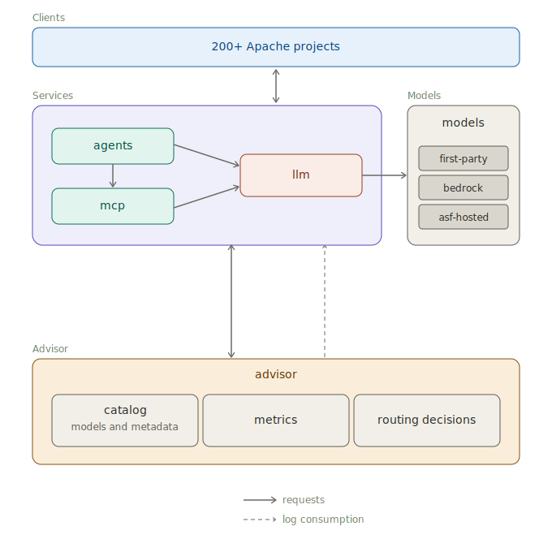

# RAI Roadmap

A proposed architecture to support the Responsible AI Initiative: a governed way
for Apache projects to use language models, agents, and tools, with the catalog,
metrics, and routing intelligence to keep it accountable.

## The architecture

See [architecture.md](architecture.md) for the full description; in brief:

- **Clients** — the 200+ Apache projects that consume the platform.
- **Services** — `agents`, `mcp`, and the `llm` gateway that all model calls
  funnel through.
- **Models** — first-party, Bedrock, and ASF-hosted backends.
- **Advisor** — the catalog, metrics, and routing decisions that make the
  platform governed and observable.

The proposal leaves open the formation of project committees which could include **LLM gateway and model management**, **agent harnesses**, and **MCP server frameworks**, which map directly onto the `llm`, `agents`, and `mcp` boxes above, and a **cross-cutting governance layer** which maps onto the `advisor` box.

## Related

- [../README.md](../README.md) — what RAI is.
- [../../platform/](../../platform/) — runbooks for the agent runtime and
  self-hosted model serving the architecture depends on.
- [../../security-pipeline/](../../security-pipeline/) — the security audit
  pipeline.
